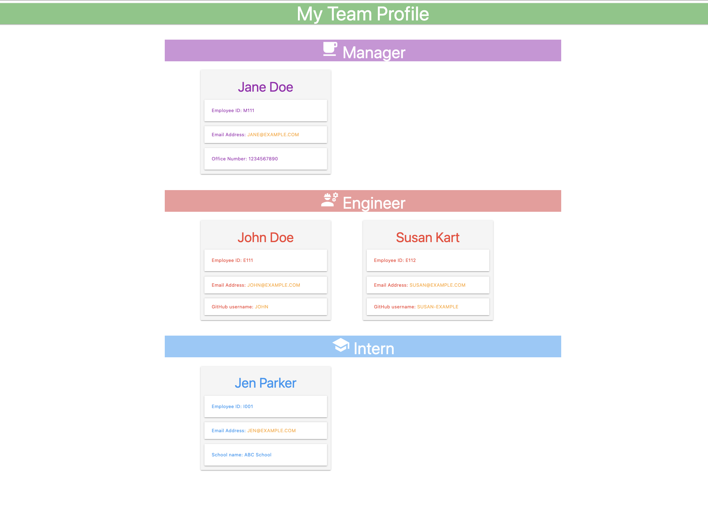

# Team-Profiler

## Description:
This application generates a team profile webpage based on user input through command line.

## Table of Contents:

* [Installation](#installation)
* [Usage](#usage)
* [Tests](#tests)
* [Packages](#packages)
* [Demo](#demo)

## Installation:
`npm install`

## Usage:
 * Install all the dependencies
 * Answer questions from the command line to generate the required webpage

## Tests:
`npm run test`

## Packages:
* [Inquirer.js](npmjs.com/package/inquirer)
* [Email-validator](https://www.npmjs.com/package/email-validator)

## Demo:

### Video: 
click [here](https://drive.google.com/file/d/1bz3_umvs9dF68iGlffpzOVLV49kMq_uL/view) to watch demo video.

### Screenshot:

## Thank you
### Author Details
**Name:** Sonali Pandey

**GitHub:** [sonali-pandey](https://github.com/sonali-pandey)
